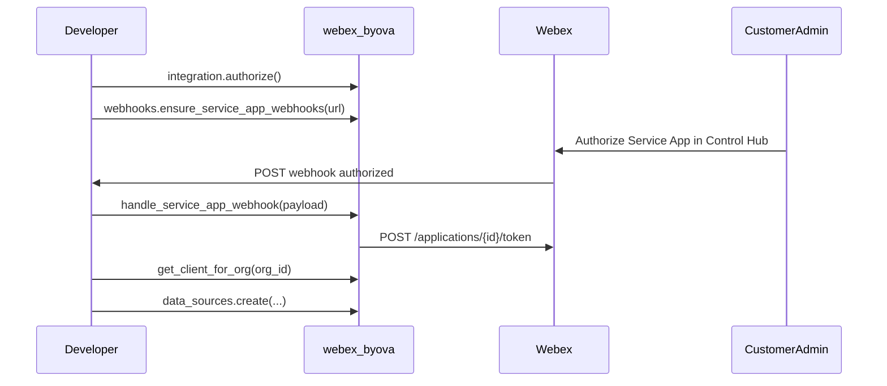

# Automated Token Flow

End-to-end flow for multi-tenant BYOVA apps.

## Steps

1. **Developer** runs `integration.authorize()` (Integration OAuth).
2. **Developer** calls `webhooks.ensure_service_app_webhooks(target_url)`.
3. **Customer admin** authorizes the Service App in Control Hub.
4. **Your HTTPS endpoint** receives `serviceApp` / `authorized` webhook.
5. Call `sdk.ahandle_service_app_webhook(payload)` — SDK fetches and stores org tokens.
6. Use `aget_client_for_org(org_id)` for DataSource CRUD.

## Deauthorization

On `deauthorized`, `handle_service_app_webhook` removes stored tokens for that org.

## Service App events use webhooks (not Mercury)

Unlike [webex_bot](https://github.com/fbradyirl/webex_bot) messaging bots, Service App lifecycle events are delivered via **HTTPS webhooks only**, not Webex Mercury WebSockets.
