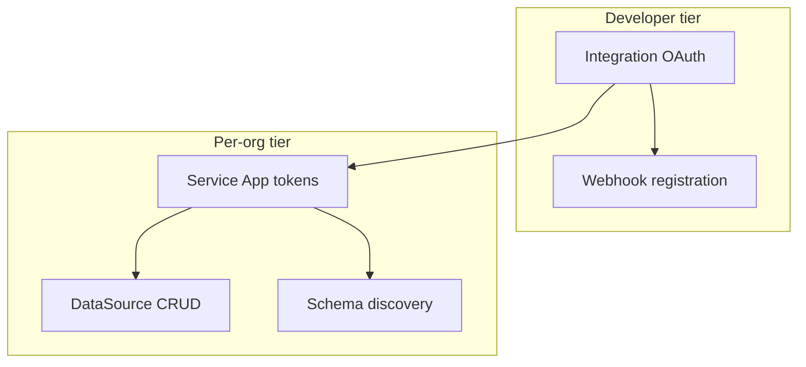
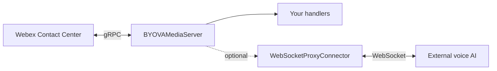

# Architecture

The SDK is built around a **two-tier credential model**, **async-first** API design, and an optional **gRPC media server** for live BYOVA voice sessions.

## Two-tier credentials



| Tier | Who authorizes | SDK component | Purpose |
|------|----------------|---------------|---------|
| Integration | Developer (you) | `IntegrationTokenManager` | OAuth, webhooks, fetch org tokens |
| Service App | Customer admin | `ServiceAppTokenManager` | Per-org API access |

See [Credentials](../credentials.md) for field details.

## BYOVA media server (optional)

The `webex_byova.media` module is installed separately via `pip install "webex-byova[media]"`. It does not change existing BYODS REST APIs.



| Component | Module | Role |
|-----------|--------|------|
| `BYOVAMediaServer` | `webex_byova.media` | Async gRPC server; registers event handlers |
| `MediaSession` / `TurnContext` | `webex_byova.media` | Per-call session and turn lifecycle |
| `MediaServerConfig` | `webex_byova.media` | Host, port, audio mode, TLS, token verification |
| `WebSocketProxyConnector` | `webex_byova.media.proxy` | Forward media/events to external backends |
| Protocol adapter | `webex_byova.media._internal` | Protobuf/gRPC — not part of the public API |

Webex connects **to your server** as a gRPC client. You implement conversational logic with decorators such as `@server.on("session_start")` — no protobuf types required. See [Media Server Overview](../media-server/index.md).

Token verification reuses the same `JWSVerifier` as BYODS when `verify_tokens=True` (default).

## Multi-tenant org model

Each customer organization that authorizes your Service App gets its own token pair stored via `TokenStorage`. Use `BYOVA.aget_client_for_org(org_id)` to obtain an `OrgClient` scoped to that org:

```python
client = await sdk.aget_client_for_org(org_id)
await client.data_sources.acreate({...})
schemas = await client.schemas.alist()
```

The SDK raises `OrgNotRegisteredError` if you request a client for an org without stored tokens. Register orgs via webhooks or `service_app.asave_registration()` — see [Authentication](../authentication.md).

## Async-first conventions

All resource methods use the `a*` prefix (`alist`, `acreate`, `aauthorize`). Sync wrappers exist on select entry points (`authorize`, `get_client_for_org`, `verify_jws_token`) for convenience; they delegate to `asyncio.run()`.

The media server is **async-only** — handlers may be sync functions; the server runs them via `asyncio.to_thread`.

**Recommended pattern (BYODS):**

```python
import asyncio
from webex_byova import BYOVA

async def main():
    sdk = BYOVA.from_env()
    try:
        await sdk.integration.aauthorize()
        # ... async API calls ...
    finally:
        await sdk.aclose()

asyncio.run(main())
```

**Recommended pattern (media server):**

```python
import asyncio
from webex_byova.media import BYOVAMediaServer

async def main():
    server = BYOVAMediaServer.from_env()

    @server.on("session_start")
    async def greet(session, turn):
        await turn.play_prompt(text="Hello")

    async with server:
        await server._grpc_server.wait_for_termination()

asyncio.run(main())
```

Always call `aclose()` on `BYOVA` when done to release HTTP connections.

## Component overview

| Component | Module | Role |
|-----------|--------|------|
| `BYOVA` | `webex_byova` | Facade wiring all BYODS subsystems |
| `IntegrationTokenManager` | `webex_byova.auth` | Developer OAuth flow |
| `ServiceAppTokenManager` | `webex_byova.auth` | Per-org token fetch/refresh |
| `WebhookManager` | `webex_byova.webhooks` | Register serviceApp hooks |
| `OrgClient` | `webex_byova.resources` | Org-scoped DataSource + Schema APIs |
| `JWSVerifier` | `webex_byova.jws` | Verify inbound data tokens |
| `BYOVAMediaServer` | `webex_byova.media` | BYOVA gRPC media server (optional extra) |

For the full API surface, see [webex_byova](../api/webex_byova.md) and [webex_byova.media](../api/media.md).
