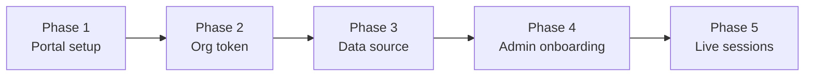
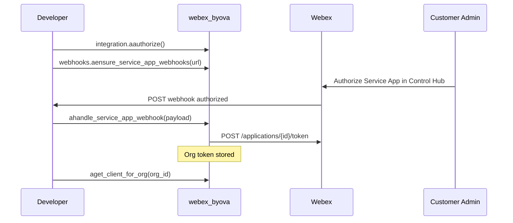

# BYOVA Data Journey

This guide walks through the complete BYOVA integration lifecycle — from registering apps on the Webex Developer Portal through live voice sessions. Use it to understand **how the steps connect** and **who does what** before diving into API details.

!!! note "Scope: voice vs. metadata-only BYODS"
    This guide follows the **voice virtual agent** path (gRPC media server) as the primary narrative. Metadata-only BYODS integrations use Phases 1–3 only; Phases 4–5 apply when Webex routes live callers to your server.

    | Phase | Voice VA integration | Metadata-only BYODS |
    |-------|---------------------|---------------------|
    | 1 — Portal setup | Required | Required |
    | 2 — Org token | Required | Required |
    | 3 — Data source registration | Required | Required |
    | 4 — Administrator onboarding | Required | Not applicable |
    | 5 — Live media sessions | Required | Not applicable |

## Introduction

Existing SDK documentation covers individual APIs — OAuth, webhooks, data sources, and the media server — but not the **end-to-end workflow** spanning developers, customer administrators, and Webex Contact Center. Developers often miss critical sequencing: you need org-scoped tokens before registering a data source, and the data source URL must reach a media-capable endpoint before Flow Designer can route callers.

**Audience**: Python developers integrating BYOVA/BYODS with the `webex-byova` SDK. Webex Contact Center administrators are a secondary audience for Phases 4–5.

**Prerequisites**:

- A [Webex Developer](https://developer.webex.com/) account
- Familiarity with Python async patterns
- For voice: network path from Webex Contact Center to your server (see [Deployment](../media-server/deployment.md))

## Journey at a Glance

| Phase | Name | Primary actor | Outcome |
|-------|------|---------------|---------|
| 1 | Portal setup | Developer | Integration + Service App registered with BYODS scopes |
| 2 | Org token acquisition | Developer + Customer Admin | Org-scoped token stored; machine account can manage Data Sources |
| 3 | Data source registration | Developer | Data source with HTTPS URL, nonce, and schema registered |
| 4 | Administrator onboarding | WCC Administrator | Flow Designer routes callers to your virtual agents |
| 5 | Live media sessions | Developer server + Webex | Bidirectional media exchange during calls |



### Roles and responsibilities

| Phase | Developer | Customer Admin | WCC Administrator | Webex platform |
|-------|-----------|----------------|-------------------|----------------|
| 1 | Register Integration and Service App | — | — | Hosts Developer Portal |
| 2 | OAuth, webhooks, handle `authorized` event | Authorize Service App in Control Hub | — | Issues org tokens |
| 3 | Create data source via API | — | — | Stores data source record |
| 4 | Deploy media server, validate reachability | — | Onboard solution in Flow Designer, configure IVR routing | Calls `ListVirtualAgents` |
| 5 | Implement session handlers | — | — | Connects as gRPC client, exchanges media |

## Phase 1 — Portal Setup (Developer)

The journey begins on the [Webex Developer Portal](https://developer.webex.com/). You register two applications:

1. **Webex Integration** — authenticates *you* (the developer) for OAuth, webhook registration, and fetching org tokens.
2. **Webex Service App** — represents your product to customer organizations. Once a customer admin authorizes it, you receive an access token on behalf of that org.

The Service App exists to obtain a token linked to a **Webex machine account**. That machine account acts as a Webex Admin with privileges to perform **Data Source CRUD** operations through the BYODS APIs.

Required Service App scopes:

- `spark-admin:datasource_read`
- `spark-admin:datasource_write`

Your Integration also needs scopes for OAuth and webhooks — see [Getting Started](../getting-started.md#prerequisites).

**Deep dives**: [Integration OAuth](../integration-oauth.md) · [Credentials](../credentials.md)

## Phase 2 — Org Token Acquisition (Developer + Customer Admin)

With apps registered, the developer:

1. Runs Integration OAuth (`integration.aauthorize()`).
2. Registers webhooks for Service App lifecycle events (`webhooks.aensure_service_app_webhooks()`).

Then a **customer administrator** authorizes your Service App in Webex Control Hub. Webex sends an `authorized` webhook to your HTTPS endpoint. Your app calls `sdk.ahandle_service_app_webhook(payload)` — the SDK fetches and stores the org-scoped access token.

The resulting token is tied to the Service App's machine account, which can now create, read, update, and delete Data Sources for that organization.



!!! warning "Do not skip ahead"
    You cannot register a data source (Phase 3) until Phase 2 completes for the target org. Calling `aget_client_for_org(org_id)` before the `authorized` webhook raises `OrgNotRegisteredError`.

**Deep dives**: [Automated Token Flow](../automated-token-flow.md) · [Webhooks](../guides/webhooks.md) · [Authentication](../authentication.md)

<a id="phase-3"></a>

## Phase 3 — Data Source Registration (Developer)

After obtaining an org-scoped client, register a data source using the Create Data Source API:

```python
client = await sdk.aget_client_for_org(org_id)
await client.data_sources.acreate({
    "audience": "MyVirtualAgent",
    "subject": "callAudioData",
    "nonce": "unique-nonce-string",
    "schemaId": "5397013b-7920-4ffc-807c-e8a3e0a18f43",
    "url": "https://your-server.example.com:50051",
    "tokenLifetimeMinutes": 60,
})
```

This tells Webex Contact Center **where to send customer data and media**:

| Field | Role in the journey |
|-------|----------------------|
| `url` | Developer-owned **HTTPS** endpoint that routes to your gRPC media server |
| `nonce` | Value Webex uses when creating a **JWT** for authenticating inbound connections |
| `schemaId` | `5397013b-7920-4ffc-807c-e8a3e0a18f43` for Voice Virtual Agent |
| `audience` | Virtual agent name exposed to the platform (align with Flow Designer routing) |

When Webex Contact Center connects for media exchange, it acts as the **gRPC client** and presents the JWT. Your media server verifies it (see [JWS Verification](../jws-verification.md) and [Deployment](../media-server/deployment.md#token-verification)).

!!! note "Transport: gRPC today"
    Voice media currently uses **gRPC** between Webex Contact Center and your server. A WebSocket-based transport is anticipated on the Webex platform but is **not available today**. The SDK's [WebSocket Proxy](../media-server/proxy.md) bridges to external AI backends — it does not replace Webex-to-server transport.

!!! tip "JWT authentication failures"
    If media connections fail with authentication errors, verify that the `nonce` in your data source matches what your `JWSVerifier` expects, and that the token has not expired (`tokenLifetimeMinutes`). See [JWS Verification](../jws-verification.md).

**Deep dives**: [Data Sources](../data-sources.md) · [Schemas](../guides/schemas.md) · [JWS Verification](../jws-verification.md)

## Phase 4 — Administrator Onboarding (WCC Administrator)

After you register a data source and deploy a reachable media server, a **Webex Contact Center Administrator** onboards your solution:

1. Opens **Flow Designer** in the customer org.
2. Configures IVR flows to route callers to the URL registered in Phase 3.
3. Selects **virtual agents** for routing rules that direct customer interactions to your solution.

### Virtual agent discovery

During onboarding, Webex calls the gRPC **`ListVirtualAgents`** RPC on your server to discover available virtual agents. Your server should return the agents administrators can select for routing.

The `webex-byova` SDK's default `ListVirtualAgents` implementation returns an **empty list**. For Flow Designer to show agents, you may need to:

- Align the data source `audience` field with agent naming expected by the platform, and/or
- Extend the gRPC servicer to return `VirtualAgentInfo` entries (no public handler API for this yet — see [API reference](../api/media.md))

### What developers can validate before admin onboarding

You do not need Flow Designer access to verify:

- [ ] Org token stored and `aget_client_for_org()` succeeds
- [ ] Data source created with correct schema and URL
- [ ] Media server listening on the registered host/port
- [ ] TLS and firewall rules allow Webex to reach your server
- [ ] JWS verification passes with a test token (or disabled for local dev)

**Deep dives**: [Media Server Quickstart](../media-server/quickstart.md) · [Deployment](../media-server/deployment.md)

<a id="phase-5"></a>

## Phase 5 — Live Media Sessions (Developer Server)

Once Flow Designer routes callers to your virtual agents, **live sessions** begin. Remember the connection direction:

```text
Webex Contact Center  ──gRPC client──►  Your BYOVAMediaServer  ──handlers──►  Your logic
```

### Session lifecycle

| Stage | What happens | SDK handler event |
|-------|--------------|-------------------|
| Session opens | Webex starts a call to your virtual agent | `session_start` |
| Turn begins | Bidirectional stream opens for one conversational turn | `turn_started` |
| Media exchange | Webex pushes caller audio; you respond with prompts | `audio_input`, `dtmf_input`, `barge_in`, `no_input` |
| Turn closes | Bot finishes speaking; stream completes | `turn_ended` |
| Session ends | Call terminates or transfers | `session_end` |

Implement handlers with `@server.on("session_start")` and related events — see [Handlers](../media-server/handlers.md). The SDK handles BYOVA protocol details (chunking, μ-law audio, turn closure) internally.

### Escalation to a human agent

Callers may request transfer to a human agent. In BYOVA protocol terms, your server signals this by sending an **`TRANSFER_TO_AGENT`** output event. A normal virtual-agent session end uses **`SESSION_END`**.

In the SDK today:

- `await session.end_session(reason=...)` terminates the session from your handler code.
- A dedicated public `transfer_to_agent()` method is not yet exposed — escalation may require protocol-level responses in a future SDK release. See [Protocol Notes](../media-server/protocol-notes.md) for output event semantics.

When Webex ends a session from its side, your server receives a `SESSION_END` input event and dispatches the `session_end` handler.

**Deep dives**: [Media Server Overview](../media-server/index.md) · [Handlers](../media-server/handlers.md) · [Protocol Notes](../media-server/protocol-notes.md) · [Deployment](../media-server/deployment.md)

## Self-Assessment Checklist

Use this checklist to confirm readiness at each phase:

- [ ] **Phase 1**: Integration and Service App registered with correct scopes
- [ ] **Phase 2**: Webhooks registered; `authorized` event received; org token stored
- [ ] **Phase 3**: Data source created with Voice VA schema, HTTPS URL, and nonce
- [ ] **Phase 4**: Media server deployed and reachable; administrator notified for Flow Designer setup
- [ ] **Phase 5**: Handlers implemented; test call completes or escalates as expected

## Next Steps

### BYODS and platform

- [Integration OAuth](../integration-oauth.md)
- [Automated Token Flow](../automated-token-flow.md)
- [Webhooks](../guides/webhooks.md)
- [Data Sources](../data-sources.md)
- [Schemas](../guides/schemas.md)
- [JWS Verification](../jws-verification.md)
- [Examples](../guides/examples.md)

### Media server

- [Media Server Overview](../media-server/index.md)
- [Quickstart](../media-server/quickstart.md)
- [Handlers](../media-server/handlers.md)
- [Configuration](../media-server/configuration.md)
- [Deployment](../media-server/deployment.md)

### SDK reference

- [webex_byova](../api/webex_byova.md)
- [webex_byova.media](../api/media.md)
